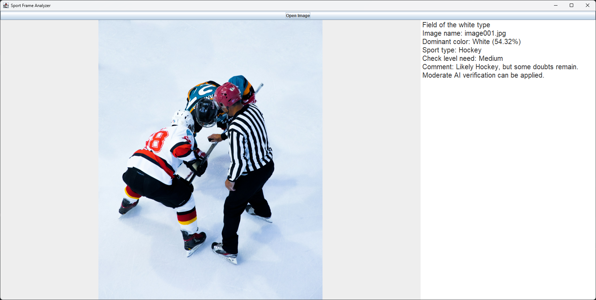
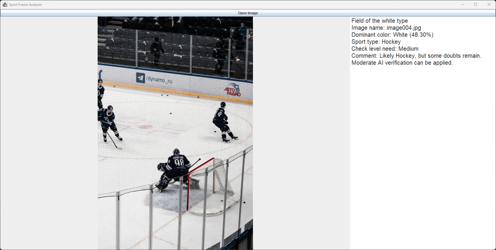
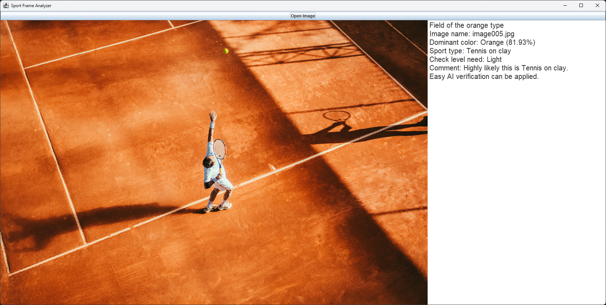
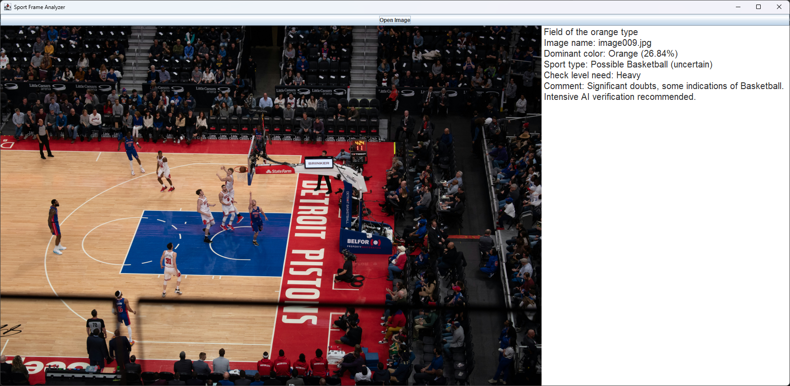
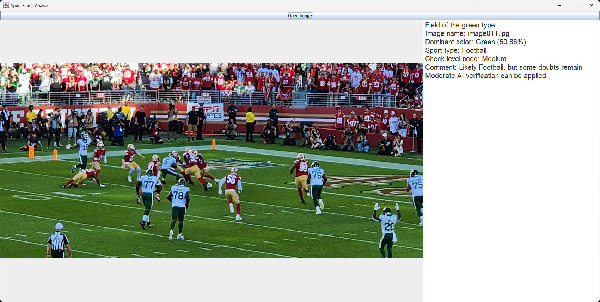
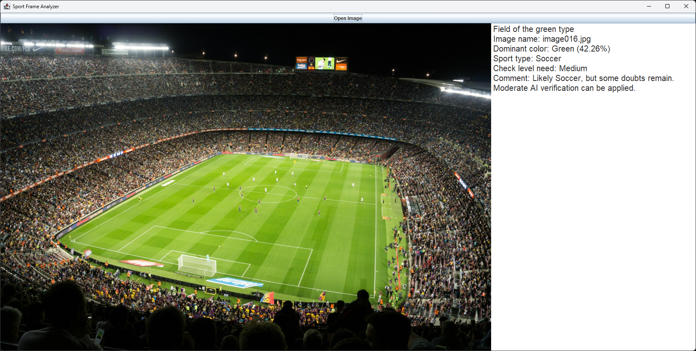
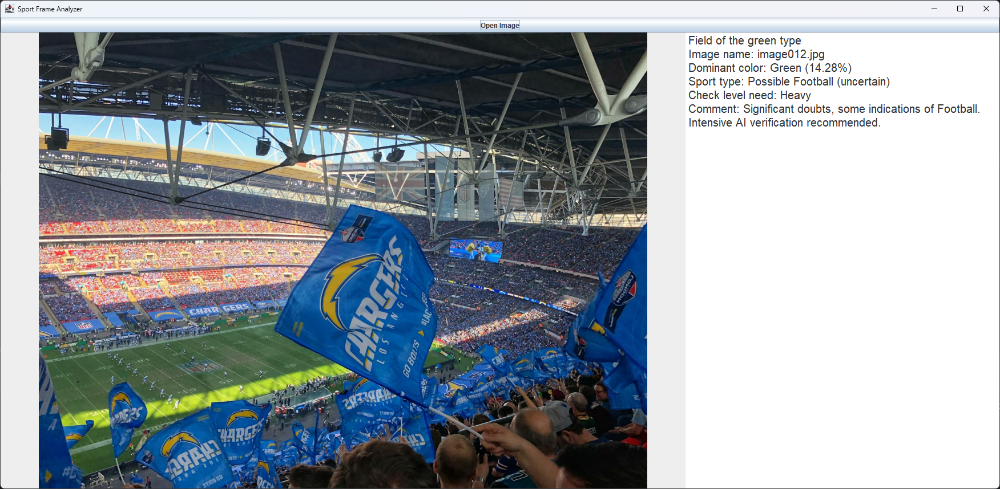
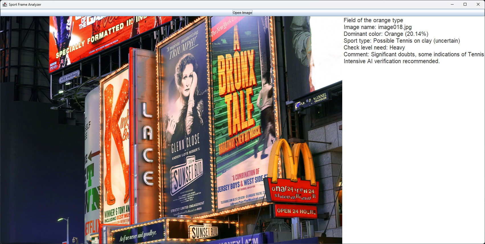
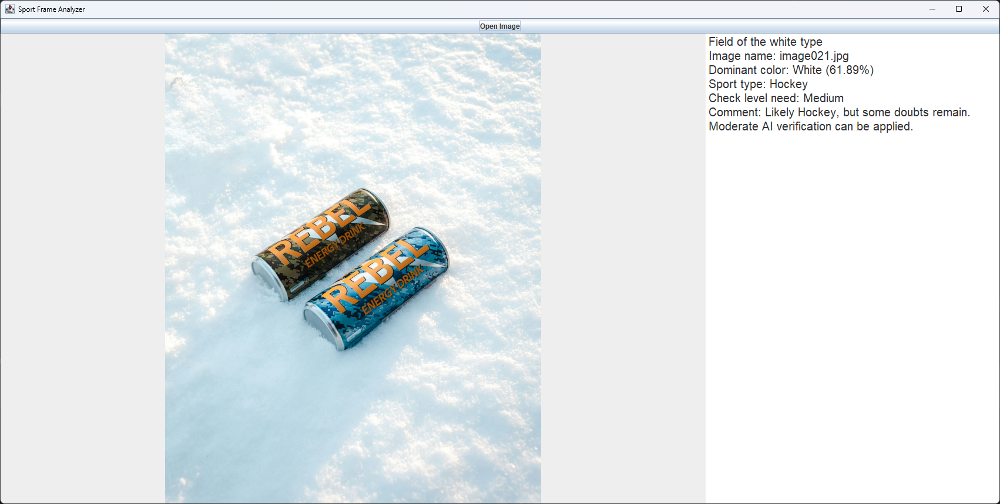

# Sport Image Analyzer (Demo)

## Table of Contents

- [Overview](#overview)
- [Features](#features)
- [Technologies Used](#technologies-used)
- [Project Structure](#project-structure)
- [How to Run](#how-to-run)
- [Example Output](#example-output)
- [License](#license)
- [Image Sources](#image-sources)

## Overview

**Sport Image Analyzer** is a demo application designed as a **pre-filter for sports content analysis**.
Its main goal is to quickly determine the likely type of sport shown in an image based on the **field/court type and
dominant colors**.
The program also estimates the **required level of computational resources** for further AI-based verification.

The core approach is to prioritize accuracy: **it is better to show a few non-sport frames than to miss an important
moment in a game**.

## Features

- **Detects dominant field color**: green, white, orange, etc.
- **Identifies the sport type**: Football, Soccer, Basketball, Hockey, Tennis, etc.
- **Estimates required AI resources for verification**:
    - **Light** → highly likely correct sport
    - **Medium** → some doubts remain
    - **Heavy** → significant doubts
- **User Interface**:
    - Select an image using a file chooser
    - Image is displayed scaled within a frame
    - Results are shown in a fixed text area

## Technologies Used

- **Java** – the project requires Java.
- **Swing** – used for building the graphical user interface (GUI).
- **OpenCV** – for image processing and analyzing sports fields.

## Project Structure

- `src/` – main Java source files
    - `dto/` – classes for image data and dominant color
    - `factory/` – strategy factory
    - `strategy/` – sport and color strategies
    - `ui/` – user interface classes
    - `util/` – utility classes (e.g., ImageAnalyzer)
- `images/` – sample images for testing
- `README.md` – project documentation

## How to Run

1. Make sure you have **Java 17+** installed.
2. Download the project or clone the repository.
3. Build the project using your IDE (e.g., IntelliJ) or via command line with Maven/Gradle if configured.
4. Run the `Main` class:
   ```bash
   java -cp path/to/your/classes Main
   ```

## Example Output

When an image is provided to the program, it analyzes the image and returns an estimated result. For example:

**Input Image:**
```image016.jpg```
**Output:**

```
Field of the green type
Image name: image016.jpg
Dominant color: Green (42.26%)
Sport type: Soccer
Check level need: Medium
Comment: Likely Soccer, but some doubts remain.
Moderate AI verification can be applied.
```

### Examples

Hockey match example 1 – correctly detected. Dominant white color (54.32%), medium AI resources recommended for
verification.



Hockey match example 2 – correctly detected. Dominant white color (48.30%), medium AI resources recommended for
verification.



Tennis match example 1 – correctly detected. Dominant Orange color (81.93%), light AI resources recommended for
verification.



Basketball/Tennis example – program differentiates between Basketball and Tennis based on brightness.
Dominant orange color (26.84%), intensive AI resources recommended for verification.



Football example – correctly detected. Dominant green color (50.88%), medium AI resources recommended.
Differentiates from Soccer by detecting parallel lines within the green field area.



Soccer example – correctly detected. Dominant green color (42.26%), medium AI resources recommended.



American Football example – program correctly detected, but low green dominance (14.28%)
due to extensive team colors (blue). Significant AI resources recommended for accurate verification.



Example of advertising – the program recognizes it as probable tennis, but with a low confidence level (20.14% dominant
color).  
Due to the uncertainty, significant artificial intelligence resources are required for verification so that the system
can correctly
distinguish it from a real sporting event. However, this is the main idea behind allocating key AI
resources to cases with a higher probability that it will not be a sporting event.



Snow advertisement during a hockey match – visually realistic but complicates recognition.  
High dominant white percentage (similar to actual hockey ice) may mislead the algorithm; alternative AI-based methods
are recommended for accurate detection.



## License

This project is released under the MIT License.  
You are free to use, modify, and distribute the code for educational and non-commercial purposes.

The images included in this project are for **educational/demo purposes only** and are credited to their respective
authors.

## Image Sources

The images used for this project are for **educational/demo purposes only**.

image001 - Photo
by <a href="https://unsplash.com/@imchenyf?utm_content=creditCopyText&utm_medium=referral&utm_source=unsplash">
YIFEI CHEN</a>
on <a href="https://unsplash.com/photos/person-playing-hockey-QWsdUMj8amc?utm_content=creditCopyText&utm_medium=referral&utm_source=unsplash">
Unsplash</a>

image002 - Photo
by <a href="https://unsplash.com/@aprilwalker?utm_content=creditCopyText&utm_medium=referral&utm_source=unsplash">April
Walker</a>
on <a href="https://unsplash.com/photos/men-playing-ice-hockey-on-ice-stadium-sqMPA86yVws?utm_content=creditCopyText&utm_medium=referral&utm_source=unsplash">
Unsplash</a>

image003 - Photo
by <a href="https://unsplash.com/@jesswilsonww24?utm_content=creditCopyText&utm_medium=referral&utm_source=unsplash">
Jessica Vink</a>
on <a href="https://unsplash.com/photos/people-playing-ice-hockey-at-the-arena-SOv0qA0waR4?utm_content=creditCopyText&utm_medium=referral&utm_source=unsplash">
Unsplash</a>

image004 - Photo
by <a href="https://unsplash.com/@klim11?utm_content=creditCopyText&utm_medium=referral&utm_source=unsplash">Klim
Musalimov</a>
on <a href="https://unsplash.com/photos/ice-hockey-players-on-ice-hockey-field-tEk5CVDgGK4?utm_content=creditCopyText&utm_medium=referral&utm_source=unsplash">
Unsplash</a>

image005 - Photo
by <a href="https://unsplash.com/@arnok?utm_content=creditCopyText&utm_medium=referral&utm_source=unsplash">Moises
Alex</a>
on <a href="https://unsplash.com/photos/man-playing-tennis-WqI-PbYugn4?utm_content=creditCopyText&utm_medium=referral&utm_source=unsplash">
Unsplash</a>

image006 - Photo
by <a href="https://unsplash.com/@johnfo?utm_content=creditCopyText&utm_medium=referral&utm_source=unsplash">John
Fornander</a>
on <a href="https://unsplash.com/photos/person-wearing-pair-of-white-low-top-sneakers-while-holding-wilson-tennis-racket-4R9CcBdQTEg?utm_content=creditCopyText&utm_medium=referral&utm_source=unsplash">
Unsplash</a>

image007 - Photo
by <a href="https://unsplash.com/@axga?utm_content=creditCopyText&utm_medium=referral&utm_source=unsplash">
Aleksandr Galichkin</a>
on <a href="https://unsplash.com/photos/a-clay-tennis-court-with-its-net-J5D8cdRWwEk?utm_content=creditCopyText&utm_medium=referral&utm_source=unsplash">
Unsplash</a>

image008 - Photo
by <a href="https://unsplash.com/@ryanjs08?utm_content=creditCopyText&utm_medium=referral&utm_source=unsplash">Ryan
Sepulveda</a>
on <a href="https://unsplash.com/photos/people-watching-basketball-game-on-stadium-o44Kz5UI2N8?utm_content=creditCopyText&utm_medium=referral&utm_source=unsplash">
Unsplash</a>

image009 - Photo
by <a href="https://unsplash.com/@gezerbatu?utm_content=creditCopyText&utm_medium=referral&utm_source=unsplash">Batu
Gezer</a>
on <a href="https://unsplash.com/photos/people-playing-basketball-on-court-Ub7upMdfM0g?utm_content=creditCopyText&utm_medium=referral&utm_source=unsplash">
Unsplash</a>

image010 - Photo
by <a href="https://unsplash.com/@zab24?utm_content=creditCopyText&utm_medium=referral&utm_source=unsplash">Zabdiel
Gonzalez</a>
on <a href="https://unsplash.com/photos/people-watching-soccer-game-during-daytime-6XU8Xbrt95M?utm_content=creditCopyText&utm_medium=referral&utm_source=unsplash">
Unsplash</a>

image011 - Photo
by <a href="https://unsplash.com/@mkaine17?utm_content=creditCopyText&utm_medium=referral&utm_source=unsplash">Fredrick
Lee</a>
on <a href="https://unsplash.com/photos/a-football-game-is-being-played-in-a-stadium-jaRCC8DBS4k?utm_content=creditCopyText&utm_medium=referral&utm_source=unsplash">
Unsplash</a>

image012 - Photo
by <a href="https://unsplash.com/@anders_kj1?utm_content=creditCopyText&utm_medium=referral&utm_source=unsplash">
Anders Krøgh Jørgensen</a>
on <a href="https://unsplash.com/photos/los-angeles-chargers-waving-flags-LwX1bBi0dwY?utm_content=creditCopyText&utm_medium=referral&utm_source=unsplash">
Unsplash</a>

image013 - Photo
by <a href="https://unsplash.com/@acrehuet98?utm_content=creditCopyText&utm_medium=referral&utm_source=unsplash">Adrià
Crehuet Cano</a>
on <a href="https://unsplash.com/photos/children-playing-soccer-LIhB1_mAGhY?utm_content=creditCopyText&utm_medium=referral&utm_source=unsplash">
Unsplash</a>

image014 - Photo
by <a href="https://unsplash.com/@alexazabache?utm_content=creditCopyText&utm_medium=referral&utm_source=unsplash">Alex
Azabache</a>
on <a href="https://unsplash.com/photos/green-soccer-field-inside-stadium-1cPWeb3Ud30?utm_content=creditCopyText&utm_medium=referral&utm_source=unsplash">
Unsplash</a>

image015 - Photo
by <a href="https://unsplash.com/@focusmitch?utm_content=creditCopyText&utm_medium=referral&utm_source=unsplash">
Mitch Rosen</a>
on <a href="https://unsplash.com/photos/crowd-watching-football-game-inside-stadium-g9SNY0aLMF0?utm_content=creditCopyText&utm_medium=referral&utm_source=unsplash">
Unsplash</a>

image016 -Photo
by <a href="https://unsplash.com/@kris1902?utm_content=creditCopyText&utm_medium=referral&utm_source=unsplash">Krzysztof
Dubiel</a>
on <a href="https://unsplash.com/photos/people-watching-soccer-game-in-stadium-hQBIJsBtyBw?utm_content=creditCopyText&utm_medium=referral&utm_source=unsplash">
Unsplash</a>

image017 - Photo
by <a href="https://unsplash.com/@stemlist?utm_content=creditCopyText&utm_medium=referral&utm_source=unsplash">Stem
List</a>
on <a href="https://unsplash.com/photos/man-and-woman-sitting-on-chair-in-front-of-monitor-E01xSjvm4eQ?utm_content=creditCopyText&utm_medium=referral&utm_source=unsplash">
Unsplash</a>

image018 - Photo
by <a href="https://unsplash.com/@deonfosu?utm_content=creditCopyText&utm_medium=referral&utm_source=unsplash">Deon
Fosu</a>
on <a href="https://unsplash.com/photos/a-bunch-of-billboards-that-are-on-the-side-of-a-building-ZQZrvL7DwiI?utm_content=creditCopyText&utm_medium=referral&utm_source=unsplash">
Unsplash</a>

image019 - Photo
by <a href="https://unsplash.com/@jpvalery?utm_content=creditCopyText&utm_medium=referral&utm_source=unsplash">Jp
Valery</a>
on <a href="https://unsplash.com/photos/mcdonalds-signage-JZX_jf9Tkco?utm_content=creditCopyText&utm_medium=referral&utm_source=unsplash">
Unsplash</a>

image020 - Photo
by <a href="https://unsplash.com/@jannerboy62?utm_content=creditCopyText&utm_medium=referral&utm_source=unsplash">Nick
Fewings</a>
on <a href="https://unsplash.com/photos/red-ferrari-car-rHlvWD8Mv_s?utm_content=creditCopyText&utm_medium=referral&utm_source=unsplash">
Unsplash</a>

image021 - Photo
by <a href="https://unsplash.com/@flovayn?utm_content=creditCopyText&utm_medium=referral&utm_source=unsplash">Florian
van Duyn</a>
on <a href="https://unsplash.com/photos/two-cans-of-energy-drink-sitting-in-the-snow-uCrLAxSS5wI?utm_content=creditCopyText&utm_medium=referral&utm_source=unsplash">
Unsplash</a>

image022 - Photo
by <a href="https://unsplash.com/@campful?utm_content=creditCopyText&utm_medium=referral&utm_source=unsplash">
Campbell</a>
on <a href="https://unsplash.com/photos/running-black-porsche-sedan-3ZUsNJhi_Ik?utm_content=creditCopyText&utm_medium=referral&utm_source=unsplash">
Unsplash</a>

image023 - Photo
by <a href="https://unsplash.com/@bangyuwang?utm_content=creditCopyText&utm_medium=referral&utm_source=unsplash">
Bangyu Wang</a>
on <a href="https://unsplash.com/photos/people-walking-on-street-during-daytime-OD7Z09OVM80?utm_content=creditCopyText&utm_medium=referral&utm_source=unsplash">
Unsplash</a>
      
      
      
      
      
      